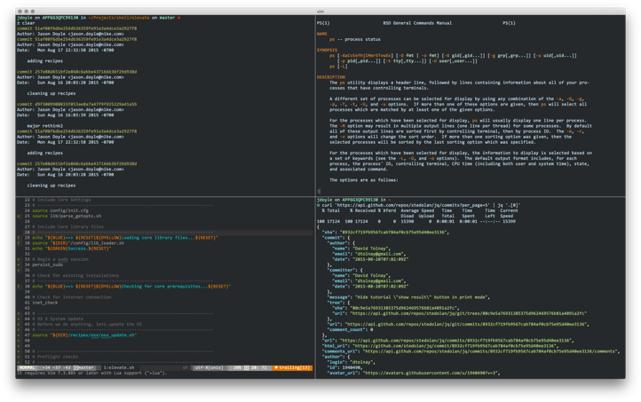
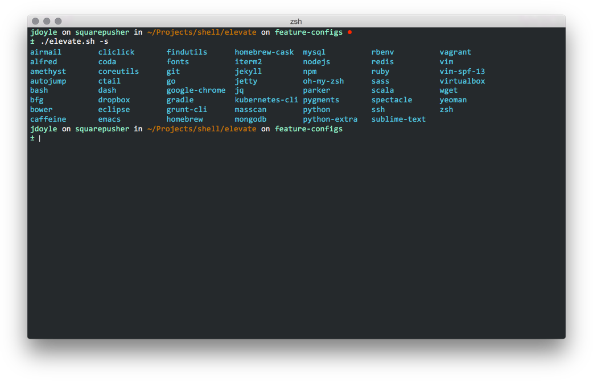
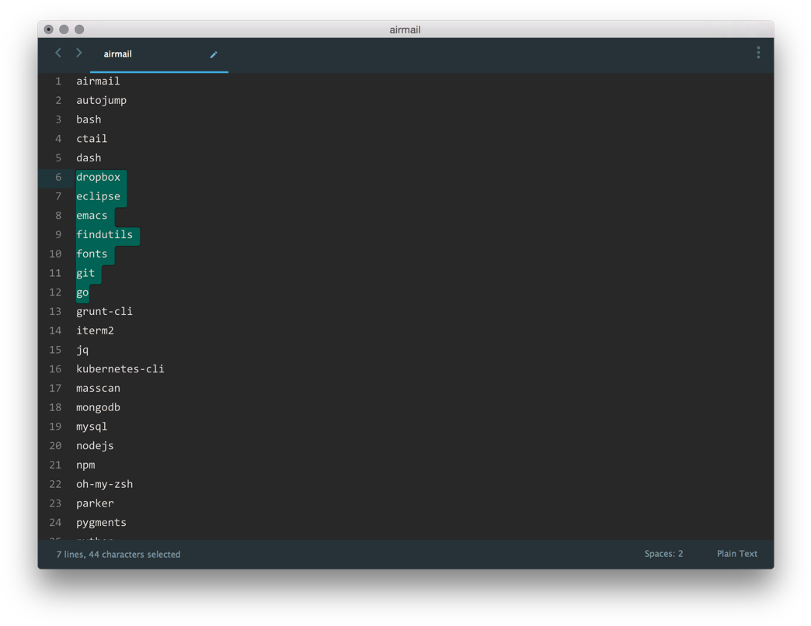

# E L E V A T E - OS X Auto Configuration



Install apps, manage dotfiles and set default app and system configurations with a single command. Elevate can be used to quicky provision a developer machine or pimp out an existing bland environment. Just run $elevate -a and begin impressing your friend(s).

So what does it do exactly? Elevate harnesses great tools like Bundler, cURL, Gem, Go, Hombrew, Homebrew Cask, npm, pip and wget to provision all the tools you need for most development environments. Next, it creates opinionated .dotfiles for the tools you install as well as predefined preferences and plugins to give you the most an app can offer. Finally, it processes a set of OS X system defaults to provide a more powerful environment for developer workflows.

Don't hesitate. You know you want to elevate.

# Installation


## 1. Download the script and unpack it 

[https://github.com/mackdoyle/osx-auto-config/archive/master.zip]()

*(Alternatively, if you already have Git installed, you can clone the repo: [git clone  git@github.com:mackdoyle/osx-auto-config.git ~/Downloads]())*

## 2. Launch Terminal and change into the project's root folder

```bash
cd ~/Downloads/elevate
```

## 3. Run the script

This script supports multiple installation options:

```bash
-a Provisions OS X with an opinionated selection of apps. For example, it will install node-sass instead of sass, etc.
-f <FILE> Pass a file that contains a line delimited list of apps to install and configure.
-l <LIST> Pass a space delimited list, in quotes, of apps to install and configure.
-s Show all supported applications.
-h Show help.
```
To run the default, and install an opinionated selection of apps, execute the following command from within the `elevate` directory.

```bash
./elevate.sh -a
```

*NOTE: If you receive a permission error when executing the script, elevate the permissions using:*

```bash
sudo chmod -R 755 *
```

----

# Selectively Installing and Configuring
To maintain finer control over apps and binaries, you can pass a file that contains only the items you want installed.

## 1. Run `./elevate.sh -s` to get a list of all supported apps.



## 2. Copy the list and paste it into a file



## 3. Remove anything you do not want and save it

## 4. Run `./elevte.sh -f ~/Desktop/my_file` passing your newly saved file using the `-f` option.

----

# List of Supported Apps
This tool manages the installation of the following apps. All are optional with the exception of the core services

*(Strikethrough items are planned for future releases)*

## Core Services

* Xcode Command Line Tools
* Homebrew
* Homebrew Cask
* Node.js and Node Package Manager


## Supported Apps

* airmail
* alfred
* autojump
* bfg
* bower
* caffeine
* ~~codekit~~
* cliclick
* ctail
* dash
* ~~dropbox~~
* ~~eclipse~~
* emacs
* ~~fonts (monospaced)~~
* ~~generator-jekyllized~~
* git
* go
* google chrome
* ~~google drive~~
* gradle
* grunt-cli
* gulp
* ~~imagealpha~~
* ~~imageoptim~~
* iterm2
* ~~java~~
* jdk 7 or 8
* ~~jekyll~~
* jetty
* kubernetes-cli
* ~~macdown~~
* masscan
* ~~monotype-skyfonts~~
* mysql
* ~~node-sass~~
* oh-my-zsh
* parker
* ~~pygments~~
* ~~python3~~
* ~~sketch-toolbox~~
* redis
* ~~rbenv~~
* ~~rbenv-bundler~~
* ruby-build
* ~~sass~~ * Default option installs node-sass instead.
* ~~scala~~
* slack
* spectacle
* sublime text
* ~~the unarchiver~~
* vagrant
* virtualbox
* vim
* vim-spf-13
* vlc
* wget
* yoeman
* z-shell

## Dotfiles and Configurations
This scripts adds and configures several dotfiles with opinionated configurations. It will also add preference settings to certain apps.

* bash
* bbedit/text wrangler
* git
* go
* ~~gradle~~
* ~~gvm~~
* ~~intellij~~
* iterm2
* ~~jdk~~
* mackdown
* rbenv
* oh my zsh
* os x system defaults
* spectacle
* ssh
* sublime text
* vim
* zsh

## OS X Configuration
Elevate will configure your OS X with the following settings.

### General

* Enable keyboard access for all controls/modals.
* Enable airdrop-over-ethernet for bridged networks.
* Enable sub-pixel rendering even if you don't have a fancy Apple display.
* Increase the window resize speed for Cocoa apps.
* Require password immediately after sleep or screensaver begins.
* Reveal IP address, hostname, OS version, etc. when clicking the clock
* in the login window.
* Disable autocorrect.
* Restart automatically if the computer freezes.

### Finder Windows

* Expand the Save panel by default in all applications.
* Expand the Printer panel by default in all applications.
* Automatically quit printer app once the print jobs complete.
* Enable **⌘ + Q** shortcut to quit Finder.
* Show all filename extensions in the finder.
* Show all hidden files in finder and menus.
* Reveal the ~/Library folder if not already.
* Show path bar.
* Allow text selection in Quick Look.
* When performing a search, search the current folder by default.
* Disable the warning when changing a file extension.
* Display the full POSIX path as the Finder window's title.
* Disable the warning shown before you empty the trash.
* Disable creating .DS_Store files on network volumes.
* Empty the trash securely by default.

### Dock

* Make hidden applications semi-transparent on the dock.
* Automatically hide and show the Dock.
* Show indicator lights for open applications in the Dock.
* Add iOS Simulator to Launchpad.


### Trackpad, mouse, keyboard, Bluetooth accessories, and input

* Enable tap to click for this user and for the login screen.
* Map bottom right corner of Trackpad to right-click.
* Disable OS X press-and-hold keys to increase key repeat rate.
* Set up a fast key repeat rate and decrease the delay until keys are repeated.

### Activity Monitor

* Show the main window when launching Activity Monitor.
* Visualize CPU usage in the Activity Monitor Dock icon.
* Show all processes in Activity Monitor.
* Sort Activity Monitor results by CPU usage.

### Sound

* Increase sound quality for Bluetooth headphones/headsets

### Terminal & iTerm 2                                                

* Only use UTF-8 in Terminal.app/iTerm.
* Auto-focus terminal on mouse hover (Doesn't seem to be supported anymore but leaving in place as a desparate hope it comes back)

## SSH
Elevate will generate your RSA Keys and Authorized Hosts file, if they do not alrady exist. 

## Coming Soon
List of features to be added

* Fully provisioned Java environment in Vagrant
* Fully provisioned Netflix OSS stack in AWS
* Fully provisioned CoreOS/Kubernetes/Docker stack in Google Cloud
* Dotfile repository with .dotfiles symlinked into the $HOME directory
